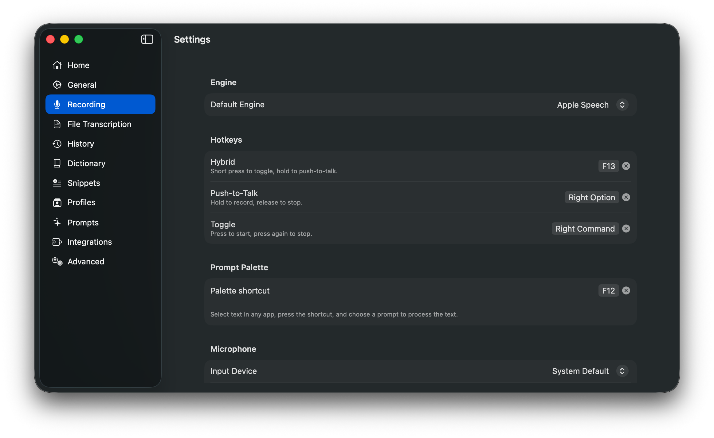
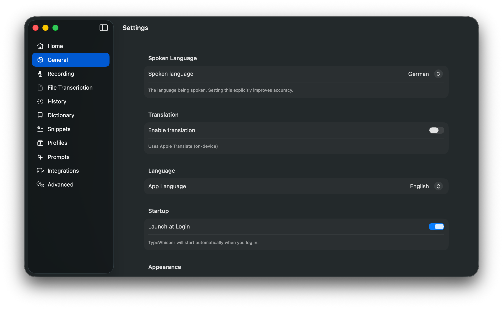

# TypeWhisper for Mac

[](https://www.gnu.org/licenses/gpl-3.0)
[](https://www.apple.com/macos/)
[](https://swift.org)

macOS 平台的语音转文字与 AI 文本处理工具。使用本地 AI 模型或云端 API（Groq、OpenAI）转录音频，然后使用自定义 LLM 提示词处理结果。使用本地模型时，语音数据保留在您的 Mac 上；也可以使用云端 API 以获得更快处理速度。

TypeWhisper `1.0` 定位于可靠的直链下载版本。核心功能包括：系统级听写、文件转录、提示词处理、Profile、历史记录、词典、代码片段以及捆绑集成。HTTP API、CLI、Widgets 和插件 SDK 作为高级功能面保持可用。

当前版本定义和发布门槛请参阅 [docs/1.0-readiness.md](docs/1.0-readiness.md)、[docs/support-matrix.md](docs/support-matrix.md) 及 [docs/release-checklist.md](docs/release-checklist.md)。

<p align="center">
  <video src="https://github.com/user-attachments/assets/22fe922d-4a4c-47d1-805e-684a148ebd03" autoplay loop muted playsinline width="270"></video>
</p>

## 截图

<p align="center">
  <a href=".github/screenshots/home.png"></a>
  <a href=".github/screenshots/recording.png"></a>
  <a href=".github/screenshots/prompts.png"></a>
</p>

<p align="center">
  <a href=".github/screenshots/history.png"></a>
  <a href=".github/screenshots/dictionary.png"></a>
  <a href=".github/screenshots/profiles.png"></a>
</p>

<p align="center">
  <a href=".github/screenshots/general.png"></a>
  <a href=".github/screenshots/plugins.png"></a>
  <a href=".github/screenshots/file-transcription.png"></a>
</p>

<p align="center">
  <a href=".github/screenshots/snippets.png"></a>
  <a href=".github/screenshots/advanced.png"></a>
</p>

## 功能特性

### 转录

- **八大引擎** - WhisperKit（99+ 语言、流式输出、翻译）、Parakeet TDT v3（25 种欧洲语言、极快）、Apple SpeechAnalyzer（macOS 26+，无需下载模型）、Qwen3 ASR（基于 MLX）、Voxtral（本地 Voxtral Mini 4B，基于 MLX）、Groq Whisper、OpenAI Whisper 及 OpenAI 兼容接口（任意 OpenAI 兼容 API）
- **本地或云端** - 所有处理均在本地 Mac 上完成，也可使用 Groq/OpenAI Whisper API 加速
- **流式预览** - 说话时实时查看部分转录结果（WhisperKit）
- **文件转录** - 拖放批量处理多个音视频文件
- **字幕导出** - 导出带时间戳的 SRT 或 WebVTT 字幕

### 听写

- **系统级** - 通过全局快捷键进行按键说话、切换或混合模式，自动粘贴到任意应用
- **修饰键快捷键** - 支持将单个修饰键（Command、Shift、Option、Control）作为快捷键
- **声音反馈** - 录音开始、转录成功和错误的音频提示
- **麦克风选择** - 选择特定输入设备并实时预览

### AI 处理

- **自定义提示词** - 使用 LLM 提示词处理转录结果（或任意文本）。内置 8 个预设（翻译、正式、摘要、修正语法、邮件、列表、精简、解释）。独立的提示词面板可通过全局快捷键呼出——一个独立于听写的 AI 文本处理浮动面板
- **LLM 提供商** - Apple Intelligence（macOS 26+）、Groq、OpenAI、Gemini 及 OpenAI 兼容接口，支持每个提示词独立选择提供商和覆盖模型
- **翻译** - 使用 Apple Translate 在设备上进行转录翻译

### 个性化

- **Profile** - 按应用和网站覆盖语言、任务、引擎、提示词、快捷键和自动提交设置。按应用（Bundle ID）和/或域名（含子域名匹配）进行匹配
- **词典** - 术语可提高云端识别准确率，纠错自动修正常见转录错误，支持从手动纠错中自动学习，内置可导入的术语包
- **代码片段** - 带触发词和替换内容的文本快捷方式，支持 `{{DATE}}`、`{{TIME}}`、`{{CLIPBOARD}}` 等占位符
- **历史记录** - 可搜索的转录历史，支持内联编辑、纠错检测、应用上下文追踪、时间线分组、筛选器、批量删除、多选导出、自动保留，以及可从托盘菜单打开的独立窗口

### 集成与扩展

- **插件系统** - 通过自定义 LLM 提供商、转录引擎、后处理器和动作插件扩展 TypeWhisper。Groq、OpenAI、OpenAI 兼容接口、Gemini、Linear、Voxtral 和 Webhook 均以捆绑插件形式提供。Linear 插件支持语音创建 Issue。详见 [Plugins/README.md](Plugins/README.md)
- **HTTP API** - 本地 REST API，用于与外部工具和脚本集成
- **CLI 工具** - 适合 Shell 环境的命令行转录工具

### 通用功能

- **首页仪表盘** - 使用统计、活动图表和引导教程
- **自动更新** - 通过 Sparkle 内置更新，支持 Stable、Release Candidate 和 Daily 频道
- **通用二进制** - 在 Apple Silicon 和 Intel Mac 上原生运行
- **Widgets** - 用于使用统计、最近转录、活动图表和转录历史的桌面小组件
- **多语言界面** - 英语和德语
- **开机自启** - 随 macOS 自动启动

## 安装

### Homebrew

```bash
brew install --cask typewhisper/tap/typewhisper
```

### 直接下载

从 [GitHub Releases](https://github.com/TypeWhisper/typewhisper-mac/releases/latest) 下载最新 DMG。

稳定的直接下载版本使用默认的 Sparkle 频道。发布候选版本如 `1.0.0-rc1` 和每日构建作为 GitHub 预发布版本发布，在各自频道上更新共享的 Sparkle appcast，不纳入 Homebrew。
已安装的版本可在 `设置 -> 关于` 中通过 `更新频道` 选择器切换频道。

## 快速开始

1. 通过 Homebrew 或最新 DMG 安装 TypeWhisper。
2. 打开设置，授予麦克风和辅助功能权限。
3. 选择引擎，必要时下载本地模型。
4. 按下全局快捷键，完成首次听写。

## 系统要求

- macOS 14.0（Sonoma）或更高版本
- 推荐使用 Apple Silicon（M1 或更新）
- 最低 8 GB RAM，较大模型推荐 16 GB 以上
- 部分功能（Apple Translate、改进的设置界面）需要 macOS 15+。Apple Intelligence 和 SpeechAnalyzer 需要 macOS 26+。

## 模型推荐

| 内存 | 推荐模型 |
|-----|---------|
| < 8 GB | Whisper Tiny、Whisper Base |
| 8-16 GB | Whisper Small、Whisper Large v3 Turbo、Parakeet TDT v3、Voxtral Mini 4B |
| > 16 GB | Whisper Large v3 |

## 构建

1. 克隆仓库：
   ```bash
   git clone https://github.com/TypeWhisper/typewhisper-mac.git
   cd typewhisper-mac
   ```

2. 用 Xcode 16+ 打开项目：
   ```bash
   open TypeWhisper.xcodeproj
   ```

3. 选择 TypeWhisper scheme 并构建（Cmd+B）。Swift Package 依赖（WhisperKit、FluidAudio、Sparkle、TypeWhisperPluginSDK）自动解析。

4. 运行应用。应用以菜单栏图标形式显示——打开设置下载模型。

5. 发布更改前运行自动化检查：
   ```bash
   xcodebuild test -project TypeWhisper.xcodeproj -scheme TypeWhisper -destination 'platform=macOS,arch=arm64' -parallel-testing-enabled NO CODE_SIGN_IDENTITY='-' CODE_SIGNING_REQUIRED=NO CODE_SIGNING_ALLOWED=NO
   swift test --package-path TypeWhisperPluginSDK
   ```

## HTTP API

HTTP API 是高级本地自动化接口，仅绑定到 `127.0.0.1`，默认禁用，仅供本地工具和脚本使用。

在 设置 > 高级 中启用 API 服务器（默认端口：`8978`）。

### 检查状态

```bash
curl http://localhost:8978/v1/status
```

```json
{
  "status": "ready",
  "engine": "whisper",
  "model": "openai_whisper-large-v3_turbo",
  "supports_streaming": true,
  "supports_translation": true
}
```

### 转录音频

```bash
curl -X POST http://localhost:8978/v1/transcribe \
  -F "file=@recording.wav" \
  -F "language=en"
```

```json
{
  "text": "Hello, world!",
  "language": "en",
  "duration": 2.5,
  "processing_time": 0.8,
  "engine": "whisper",
  "model": "openai_whisper-large-v3_turbo"
}
```

可选参数：
- `language` - ISO 639-1 代码（例如 `en`、`de`）。省略则为自动检测。
- `task` - `transcribe`（默认）或 `translate`（翻译为英语，仅 WhisperKit 支持）。
- `target_language` - 翻译目标语言的 ISO 639-1 代码（例如 `es`、`fr`）。使用 Apple Translate。

### 列出模型

```bash
curl http://localhost:8978/v1/models
```

```json
{
  "models": [
    {
      "id": "openai_whisper-large-v3_turbo",
      "engine": "whisper",
      "ready": true
    }
  ]
}
```

### 历史记录

```bash
# 搜索历史
curl "http://localhost:8978/v1/history?q=meeting&limit=10&offset=0"

# 删除条目
curl -X DELETE "http://localhost:8978/v1/history?id=<uuid>"
```

### Profile

```bash
# 列出所有 Profile
curl http://localhost:8978/v1/profiles

# 切换 Profile 开/关
curl -X PUT "http://localhost:8978/v1/profiles/toggle?id=<uuid>"
```

### 听写控制

```bash
# 开始听写
curl -X POST http://localhost:8978/v1/dictation/start

# 停止听写
curl -X POST http://localhost:8978/v1/dictation/stop

# 查看听写状态
curl http://localhost:8978/v1/dictation/status
```

## CLI 工具

TypeWhisper 包含一个适合 Shell 环境的命令行转录工具。它是高级自动化接口的一部分，连接到本地运行中的 API 服务器。

### 安装

在 设置 > 高级 > CLI 工具 > 安装 中安装。这会将 `typewhisper` 二进制文件放置到 `/usr/local/bin`。

### 命令

```bash
typewhisper status              # 显示服务器状态
typewhisper models              # 列出可用模型
typewhisper transcribe file.wav # 转录音频文件
```

### 选项

| 选项 | 描述 |
|--------|-------------|
| `--port <N>` | 服务器端口（默认：自动检测）|
| `--json` | 以 JSON 格式输出 |
| `--language <code>` | 源语言（例如 `en`、`de`）|
| `--task <task>` | `transcribe`（默认）或 `translate` |
| `--translate-to <code>` | 翻译目标语言 |

### 示例

```bash
# 指定语言并以 JSON 输出进行转录
typewhisper transcribe recording.wav --language de --json

# 从 stdin 管道输入音频
cat audio.wav | typewhisper transcribe -

# 在脚本中使用
typewhisper transcribe meeting.m4a --json | jq -r '.text'
```

CLI 需要 API 服务器处于运行状态（设置 > 高级），遵循已文档化的 `1.0.x` 命令和参数接口。

## Profile

Profile 允许您按应用或网站配置转录设置。例如：

- **邮件** - 德语，Whisper Large v3
- **Slack** - 英语，Parakeet TDT v3
- **终端** - 英语，启用自动提交
- **github.com** - 英语（在任意浏览器中均生效）
- **docs.google.com** - 德语，翻译为英语

在 设置 > Profile 中创建 Profile。分配应用和/或 URL 模式，设置语言/任务/引擎覆盖，分配自定义提示词以自动后处理，配置每个 Profile 的快捷键，启用自动提交（自动在聊天应用中发送文本），以及调整优先级。URL 模式支持子域名匹配——例如 `google.com` 也会匹配 `docs.google.com`。域名自动补全会从您的转录历史中建议域名。

开始听写时，TypeWhisper 会按以下优先级将当前应用和浏览器 URL 与您的 Profile 进行匹配：
1. **应用 + URL 匹配** - 最高优先级（例如 Chrome + github.com）
2. **仅 URL 匹配** - 跨浏览器 Profile（例如任意浏览器中的 github.com）
3. **仅应用匹配** - 通用应用 Profile（例如整个 Chrome）

当前 Profile 名称会显示在凹口指示器徽章中。

可以同时加载多个引擎，以便在 Profile 之间即时切换。请注意，加载多个本地模型会增加内存使用。云端引擎（Groq、OpenAI）的内存开销可以忽略不计。

## 插件

TypeWhisper 支持通过插件添加自定义 LLM 提供商、转录引擎、后处理器和动作插件。插件是 macOS `.bundle` 文件，放置在 `~/Library/Application Support/TypeWhisper/Plugins/`。

所有 11 个引擎和集成（WhisperKit、Parakeet、SpeechAnalyzer、Qwen3、Voxtral、Groq、OpenAI、OpenAI 兼容接口、Gemini、Linear、Webhook）均以捆绑插件形式实现，可作为参考实现。

完整插件开发指南（包括事件总线、主机服务 API 和清单格式）请参阅 [Plugins/README.md](Plugins/README.md)。

## 架构

```
TypeWhisper/
├── typewhisper-cli/           # 命令行工具（status、models、transcribe）
├── Plugins/                # 捆绑插件（WhisperKit、Parakeet、SpeechAnalyzer、Qwen3、
│                           #   Voxtral、Groq、OpenAI、OpenAI 兼容接口、Gemini、Linear、Webhook）
├── TypeWhisperPluginSDK/   # 插件 SDK（Swift 包）
├── TypeWhisperWidgetExtension/ # WidgetKit 小组件（统计、活动、历史）
├── TypeWhisperWidgetShared/    # 共享小组件数据模型
├── App/                    # 应用入口、依赖注入
├── Models/                 # 数据模型（TranscriptionResult、Profile、PromptAction 等）
├── Services/
│   ├── Cloud/              # KeychainService、WavEncoder（共享云端工具）
│   ├── LLM/               # Apple Intelligence 提供商（云端 LLM 提供商为插件）
│   ├── HTTPServer/         # 本地 REST API（HTTPServer、APIRouter、APIHandlers）
│   ├── ModelManagerService # 转录调度（委托给插件）
│   ├── AudioRecordingService
│   ├── AudioFileService    # 音视频 - 16kHz PCM 转换
│   ├── HotkeyService
│   ├── TextInsertionService
│   ├── ProfileService      # 按应用 Profile 匹配和持久化
│   ├── HistoryService      # 转录历史持久化（SwiftData）
│   ├── DictionaryService   # 自定义术语纠错
│   ├── SnippetService      # 带占位符的文本片段
│   ├── PromptActionService # 自定义提示词管理（SwiftData）
│   ├── PromptProcessingService # 提示词执行的 LLM 编排
│   ├── PluginManager       # 插件发现、加载和生命周期
│   ├── PluginRegistryService # 插件市场（下载、安装、更新）
│   ├── PostProcessingPipeline # 基于优先级的文本处理链
│   ├── EventBus            # 类型化发布/订阅事件系统
│   ├── TranslationService  # 通过 Apple Translate 进行设备端翻译
│   ├── SubtitleExporter    # SRT/VTT 导出
│   └── SoundService        # 录音事件音频反馈
├── ViewModels/             # MVVM 视图模型（Combine）
├── Views/                  # SwiftUI 视图
└── Resources/              # Info.plist、entitlements、本地化、音效
```

**模式：** MVVM 架构，使用 `ServiceContainer` 单例进行依赖注入。ViewModel 使用静态 `_shared` 模式。本地化通过 `String(localized:)` 和 `Localizable.xcstrings` 实现。

## 许可证

GPLv3 - 详见 [LICENSE](LICENSE)。商业许可可用 - 参见 [LICENSE-COMMERCIAL.md](LICENSE-COMMERCIAL.md)。
